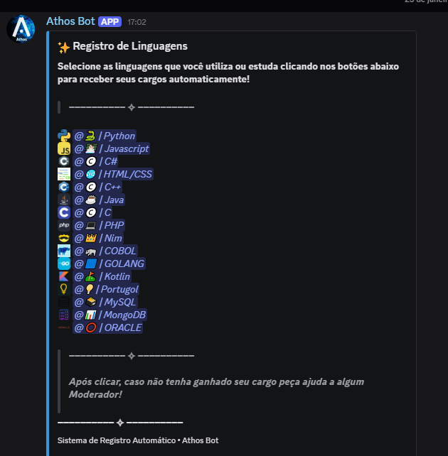
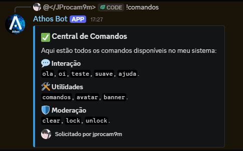

# 🤖 Athos Bot

O **Athos Bot** é um bot de automação e moderação para Discord desenvolvido em Python. Criado para facilitar a gestão de comunidades, ele oferece um sistema robusto de auto-role (cargos por reação) e comandos essenciais de moderação.

## ✨ Funcionalidades

* **⚙️ Registro Automático**: Sistema de cargos por reação (Reaction Roles) com suporte a múltiplos emojis e mapeamento dinâmico de IDs.

* **🛡️ Moderação**: Comandos para limpeza de chat (`!clear`), além de trancar (`!lock`) e destrancar (`!unlock`) canais rapidamente.
* **👋 Boas-vindas**: Atribuição automática de cargo (Auto-role) para novos membros que entram no servidor.
* **👤 Utilidades**: Comandos para exibir avatar de usuários e informações gerais.
* **💬 Interação**: Respostas rápidas e central de comandos organizada em Embeds.

## 🚀 Tecnologias Utilizadas

* **Python**: Linguagem base do projeto.
* **Discord.py**: API wrapper para interação com o ecossistema do Discord.
* **Python-dotenv**: Gerenciamento seguro de variáveis de ambiente para o `BOT_TOKEN`.

## 📋 Comandos Disponíveis

| Comando | Descrição | Permissão |
| :--- | :--- | :--- |
| `!setup_registro` | Envia o painel de registro de linguagens com reações | Administrador |
| `!clear [qtd]` | Apaga um número específico de mensagens | Gerenciar Mensagens |
| `!lock` / `!unlock` | Bloqueia ou desbloqueia o envio de mensagens no canal | Gerenciar Canais |
| `!avatar [@user]` | Exibe a foto de perfil do usuário mencionado ou a sua | Livre |
| `!comandos` | Abre a central de comandos do bot | Livre |

---
